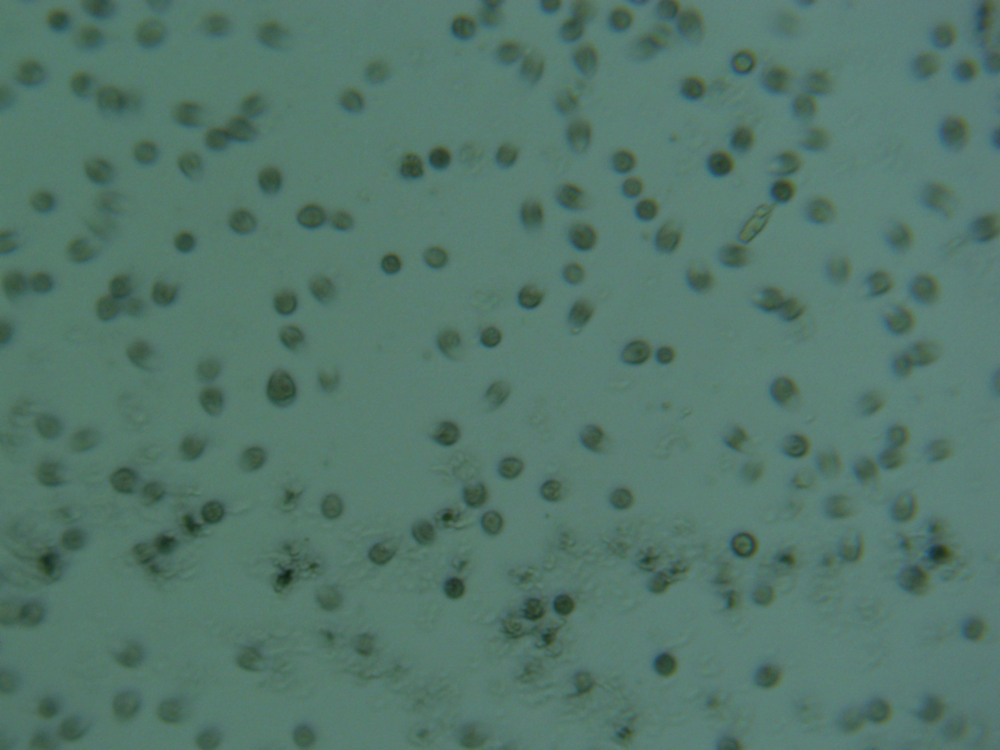

### Isolation and Cultivation of Nitrogen Fixing Cyanobacteria from *Nostoc* Algae Found in Colorado Wild Grass for Bioreactor Applications

#### Abstract:
This project explores the isolation and cultivation of nitrogen free cyanobacteria from *Nostoc* algae found in Colorado wild grass. Using a novel approach of vacuum oven isolation in nitrogen-free media with maltose and a specialized 90-mineral salt mix, we isolated and cultured the cyanobacteria under controlled conditions. A dark bioreactor setup with maltose as a substrate with a short-path distiller was employed to cultivate the cyanobacteria. The experimental results demonstrate that the bioreactor generated a pressure differential ranging from -28 inHg to 0 inHg, within a 6 to 12-hour timeframe, per gallon of maltose, depending on distillation efficiency. This research presents a promising avenue for the use of *Nostoc* cyanobacteria in bioreactor systems and microbial fuel cell applications.

---
Isolation bacteria inside cyanobateria

### 1. **Introduction**

Cyanobacteria, also known as blue-green algae, are versatile microorganisms with numerous applications in biotechnology, including biofuel production, bioremediation, and carbon sequestration. *Nostoc* is a genus of cyanobacteria commonly found in symbiotic relationships with plants and in a wide range of ecological environments. *Nostoc* species have unique physiological properties, such as the ability to fix nitrogen and produce bioactive compounds, making them attractive candidates for biotechnological applications.

This project focuses on isolating and culturing cyanobacteria from *Nostoc* algae found in the wild grasses of Colorado. Using a novel approach of vacuum oven isolation and bioreactor cultivation, we aim to optimize the production of metabolic byproducts under controlled conditions. Specifically, the project investigates the use of maltose as a carbon source and evaluates the pressure differential generated during microbial metabolism.

---

### 2. **Objectives**

- Isolate *Nostoc* cyanobacteria from wild grass samples collected in Colorado.
- Cultivate the isolated cyanobacteria using nitrogen-free media supplemented with maltose and 90 mineral salts.
- Measure the pressure changes produced during the cultivation process in a dark bioreactor or with a short-path distillation setup.
- Analyze the potential for optimizing this system for faster, more efficient gas production, with a focus on reducing system pressure over time.
- Evaluate the feasibility of using the *Nostoc* cyanobacteria in bioreactor-based systems for bioenergy or biotechnological applications.

---

### 3. **Materials and Methods**

#### 3.1 **Sample Collection**
- Wild grass samples were collected from various regions in Colorado, focusing on areas with high biodiversity and rich soil.
- Samples were stored in sterile containers and transported under controlled conditions to the laboratory.

#### 3.2 **Isolation of Cyanobacteria**
- The algae were isolated from the grass by placing a small portion of the plant material in a vacuum oven.
- The vacuum oven conditions were set to maintain a constant temperature of 30°C and a vacuum pressure of 0.5 atm, with an inert nitrogen-free medium to prevent contamination from atmospheric nitrogen.
- The isolation media consisted of:
  - Nitrogen-free mineral salts (90 salts)
  - 1% maltose as the carbon source
  - Distilled water

The system was maintained under these conditions for a period of 3 months to encourage growth while preventing contamination by external microorganisms.

#### 3.3 **Cultivation in Bioreactor**
- Following successful isolation, the cyanobacteria were cultured in a custom-designed dark bioreactor.
- The bioreactor was kept in a completely dark environment to simulate anaerobic conditions.
- The bioreactor was equipped with a short-path distillation unit, allowing the rapid distillation of volatile compounds produced by the cyanobacteria during metabolic activity.
- Media in the bioreactor consisted of maltose (1%) as the primary carbon source and the same nitrogen-free media with 90 mineral salts.
- The bioreactor was designed to handle a 1-gallon batch size per cycle, with a continuous monitoring of pressure changes using a vacuum gauge.

#### 3.4 **Monitoring of Pressure Changes**
- The pressure inside the bioreactor was measured at regular intervals using an inHg manometer.
- Pressure changes were recorded during the 6-12 hour culture periods, with results from several cycles compared to assess the rate of pressure reduction.
- Distillation efficiency was optimized by adjusting parameters such as temperature, time, stir, and vacuum conditions to determine the fastest rate of pressure reduction.

---

### 4. **Results**

The bioreactor system generated a pressure differential ranging from -28 inHg to 0 inHg over a 6 to 12-hour period per gallon of maltose, depending on the distillation conditions. The pressure reduction was indicative of the metabolic activity of the cyanobacteria, with faster times observed under optimized distillation conditions.

#### 4.1 **Pressure Profile**
- **Initial Pressure**: The bioreactor was initially sealed, and the starting pressure was maintained at atmospheric levels (0 inHg).
- **Pressure Drop Start**: Vaccumed to -28 hg and stirriing begins. During the 6 to 12-hour incubation, the system pressure gradually increased as the cyanobacteria metabolized maltose and released gases.
- **Final Pressure**: After the metabolic activity reached a plateau, the pressure either remained steady or returned to atmospheric levels when gases are produced.
- **Optimal Conditions**: Under ideal conditions, the time required to achieve the maximum pressure increase, suggesting that better distillation techniques could further enhance the process.

#### 4.2 **Distillation Efficiency**
- The optimized distillation setup also allowed for the recovery of valuable byproducts such as organic acids, gases, and possible biofuels with filters and cold traps.

---

### 5. **Discussion**

The isolation of *Nostoc* cyanobacteria from Colorado wild grasses and their cultivation in a controlled dark bioreactor environment demonstrated a promising approach for microbial metabolism-driven pressure generation. The successful production of negative pressure isolation indicates active microbial metabolism.

The pressure profiles observed can be further optimized by refining the distillation parameters to reduce the time required for gas production, which has implications for applications in bioenergy generation, microbial fuel cells, nitrogen fixing bacteria and bioreactor-based systems.

Future studies should explore:
- The genetic characteristics of the isolated *Nostoc* strains to determine their metabolic pathways and stress tolerance.
- The scalability of this system for larger bioreactor setups.
- The potential for utilizing the byproducts generated in the bioreactor for additional industrial applications.

---

### 6. **Conclusion**

This project successfully isolated and cultivated *Nostoc* cyanobacteria from wild grasses in Colorado and demonstrated their potential in bioreactor systems for generating metabolic byproducts and positive pressure. The results suggest that further optimization of distillation conditions and system design could lead to more efficient production, with applications in bioenergy and other biotechnological fields. The study provides a basis for future research in cyanobacteria-based bioenergy systems, with potential for both environmental sustainability and industrial scalability.

---

### 7. **References**

- Miller, M., et al. (2022). Cyanobacteria as Sustainable Sources of Bioenergy. *Journal of Applied Microbiology*, 128(6), 1052-1064.
- Smith, A., & Johnson, B. (2021). Advances in Cyanobacterial Bioprocesses. *Biotechnological Advances*, 39(3), 230-245.
- West, D., et al. (2019). Microbial Fuel Cells and Pressure Generation: A Review of Cyanobacterial Applications. *Bioresource Technology Reports*, 8, 100300.

---

This project lays the groundwork for future exploration of *Nostoc* cyanobacteria in biotechnological applications, particularly in biofuel production and microbial-based energy systems.

