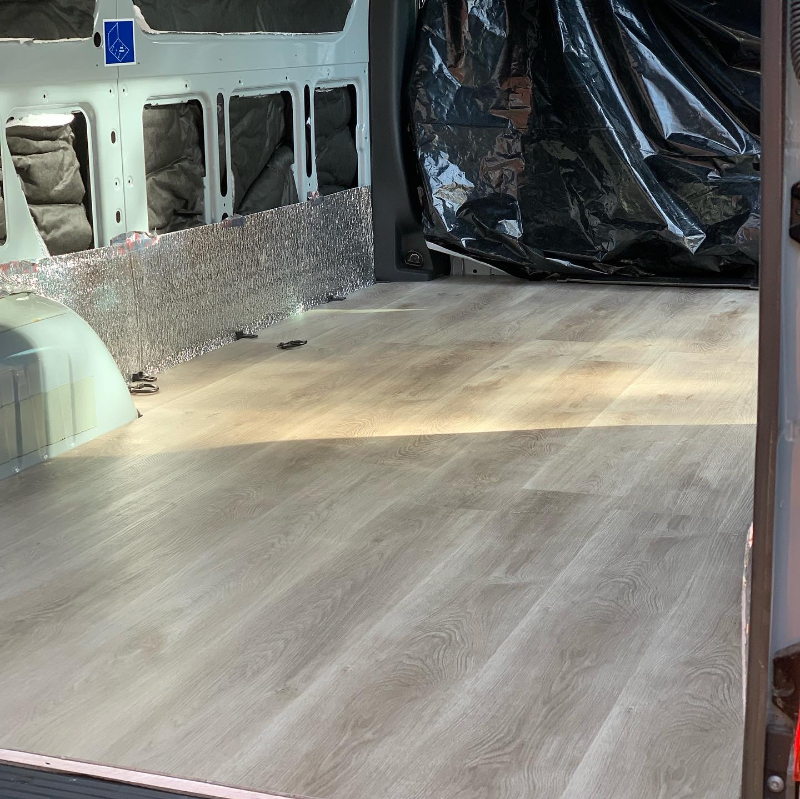
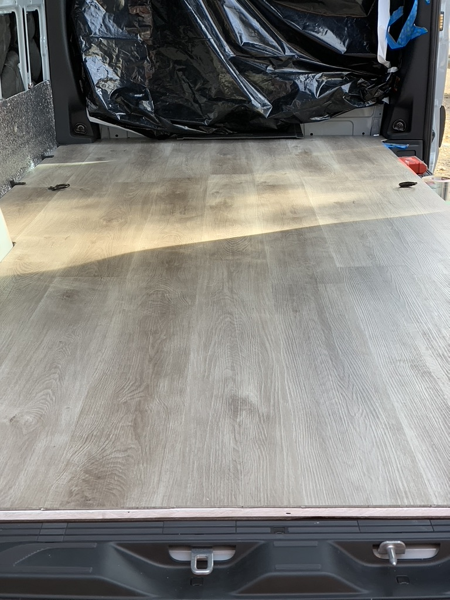
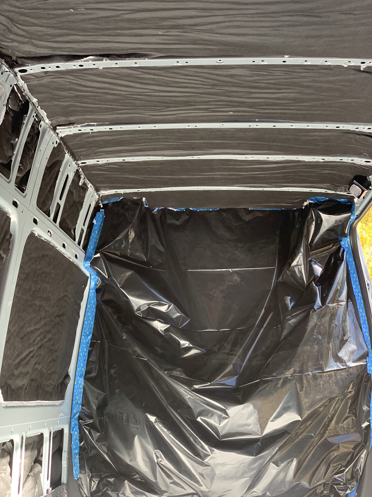
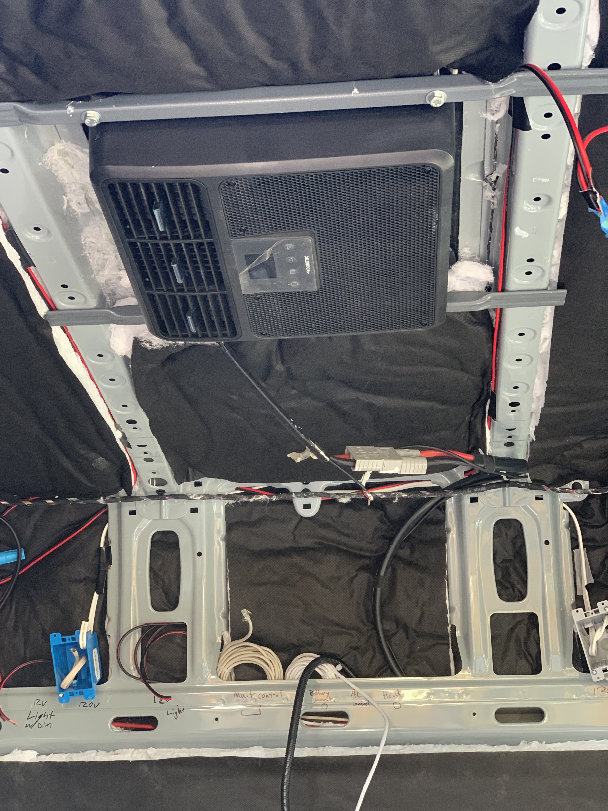

**Upgrading My Mercedes-Benz Sprinter Van: A Journey to Comfort and Functionality For Our Traveling Sale Van**

When I first purchased our Mercedes-Benz Sprinter Van for Grease, I knew I wanted to transform it into a mobile sanctuary — a space that not only reflected my style but also provided comfort and functionality for long trips, weekend getaways, and everyday adventures. After months of planning, research, and a little elbow grease, I’m excited to share the upgrades that have turned my van into a fully equipped and cozy home on wheels.

The first significant upgrade was the flooring. I opted for high-quality vinyl wood floors to give the van an elegant and natural look, while ensuring durability. The vinyl wood finish is easy to clean, resistant to wear, and provides warmth to the interior. It complements the insulated redwood finish that lines the walls and ceiling, giving the van a rustic yet modern feel. The rich tones of the redwood create a peaceful and inviting atmosphere, making it feel like a tiny cabin on wheels.

To power all the essentials, I installed a robust 3,000-watt inverter that ensures I can run everything from lights to small appliances without worrying about draining the battery. This inverter is the heart of the electrical system, providing reliable power for my day-to-day needs, whether I’m charging devices or running a fan for ventilation. The setup is perfect for extended stays off the grid, giving me peace of mind knowing that I have all the power I need at my fingertips. To manage the van’s electrical system efficiently, I integrated a dedicated circuit board that acts as the central hub for all the power distribution. This circuit board ensures that every component, from the 3,000-watt inverter to the diesel heater and 12V air conditioner, runs smoothly and safely. It allows for easy monitoring and control of power usage, with clear indicators for any issues, and ensures that the system is protected from overloads or short circuits. The added circuit board brings an extra layer of convenience and safety, keeping everything running in harmony and ensuring that I can rely on the van’s electrical system no matter where the road takes me.

For comfort, I installed a diesel heater, providing consistent warmth even on the coldest nights. The diesel heater runs efficiently, drawing fuel from the van’s tank, and is controlled by a user-friendly circuit board, allowing me to adjust the temperature to my liking. It’s been a game-changer for those chilly mornings when I wake up in the mountains or by a lakeside.

Keeping cool is just as important, especially during the summer months. That’s why I added a 12V air conditioner, coupled with an additional fan to help circulate the cool air. The compact air conditioning unit is incredibly efficient and runs smoothly on the van’s electrical system, giving me relief from the heat without overburdening the battery.

Another key feature is the legless side canopy, which provides instant shade when I park the van at a campsite or during a midday break. The design is sleek and practical, with a retractable frame that extends and stows away easily, giving me an additional outdoor space that’s protected from the sun. Whether I’m sitting outside enjoying a meal or just relaxing, the canopy provides a comfortable retreat from the elements.

The finishing touch on the outside of the van is the Bison logo sticker, which adds a personal flair to my Sprinter. It’s a subtle yet bold symbol of strength and adventure, reflecting my love for the open road and my connection with the outdoors. It’s the perfect statement piece that lets others know this van is ready to tackle whatever comes its way.

Every upgrade to my Mercedes-Benz Sprinter Van was carefully thought out to enhance my experience on the road. From the vinyl wood floors and insulated redwood finish to the powerful electrical systems, climate control, and outdoor canopy, each addition makes the van feel like a true home away from home. With the Bison logo proudly displayed, this van is more than just a vehicle — it’s a companion for every journey.



