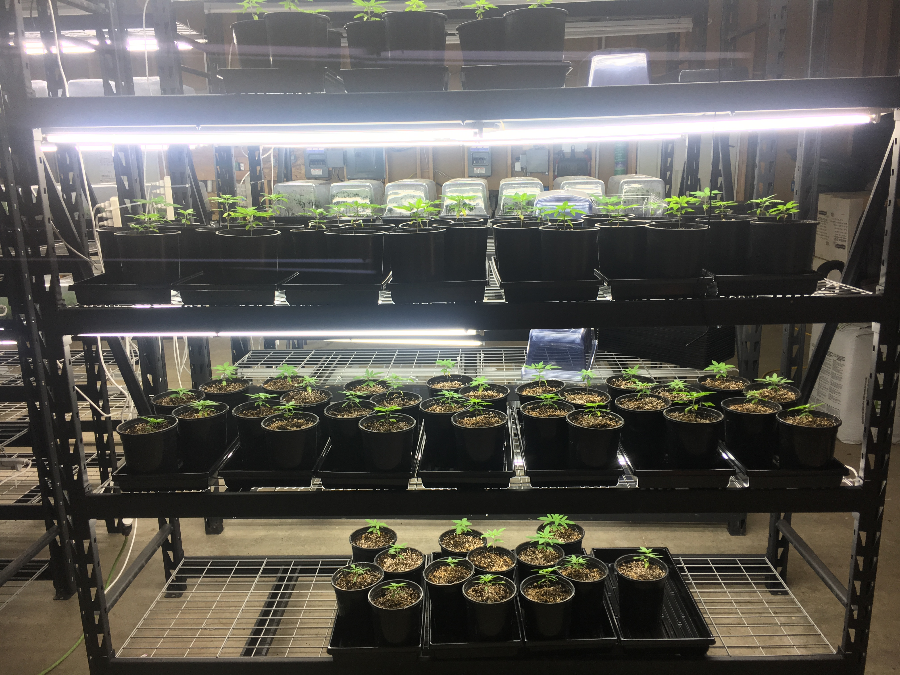
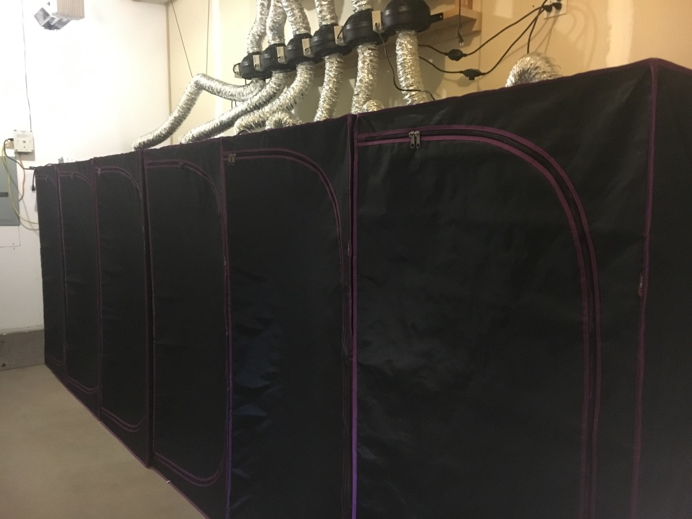
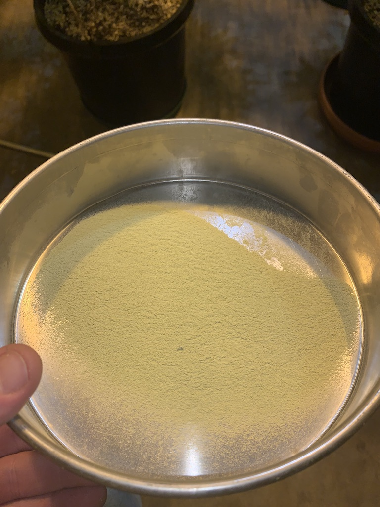
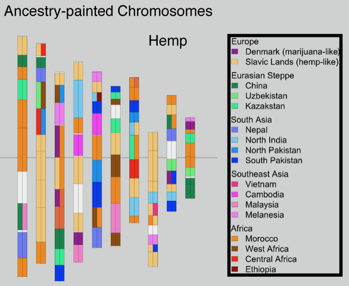
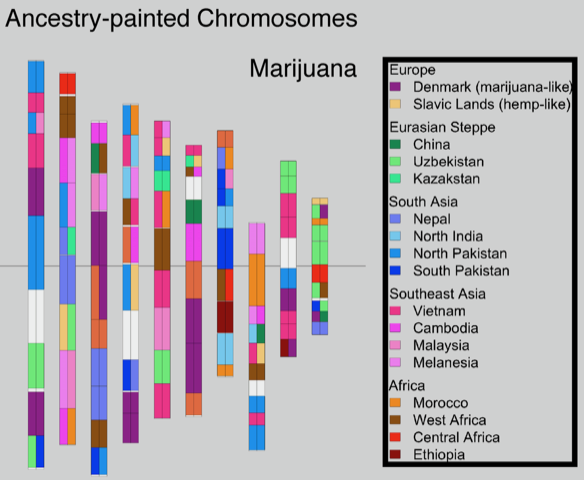

## I was the grower behind the work of Sunshine Genetics and CJ Schwartz work. See the pubished work below with the publications made.

https://pubmed.ncbi.nlm.nih.gov/33521943

https://pubmed.ncbi.nlm.nih.gov/33521943

https://www.researchgate.net/profile/Cj-Schwartz

## Publications

https://img1.wsimg.com/blobby/go/ae5acd71-25f1-4bed-bb19-e136d9863617/downloads/What%20the%20Marijuana%20Genome%20Map%20Means%20for%20the%20Fu.pdf?ver=1614371653686

https://img1.wsimg.com/blobby/go/ae5acd71-25f1-4bed-bb19-e136d9863617/downloads/An%20Introduction%20to%20Cannabis%20Genetics%2C%20Part%20i_C.pdf?ver=1614371653687

https://img1.wsimg.com/blobby/go/ae5acd71-25f1-4bed-bb19-e136d9863617/downloads/An%20Introduction%20to%20Cannabis%20Genetics%2C%20Part%20ii_.pdf?ver=1614371653687

https://img1.wsimg.com/blobby/go/ae5acd71-25f1-4bed-bb19-e136d9863617/downloads/An%20Introduction%20to%20Cannabis%20Genetics%2C%20Part%20iii.pdf?ver=1614371653687