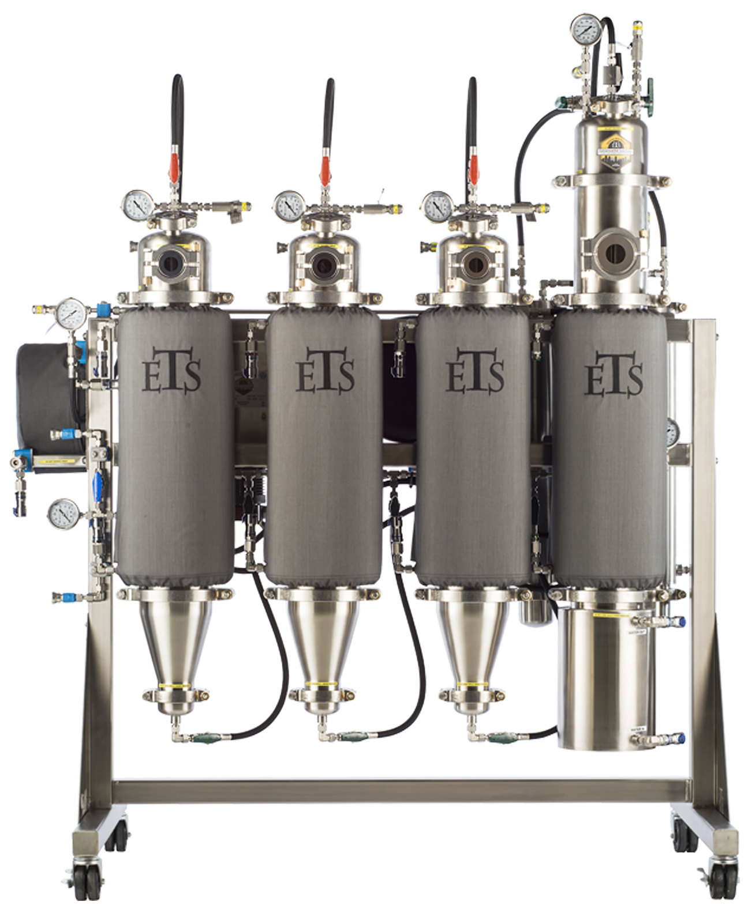
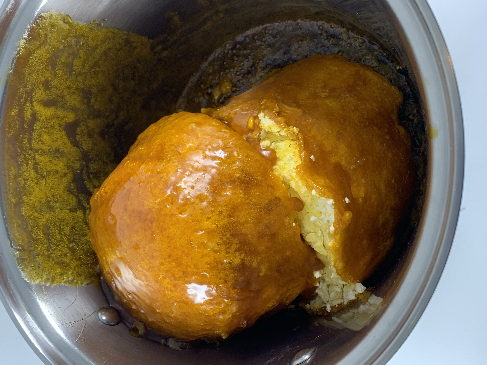
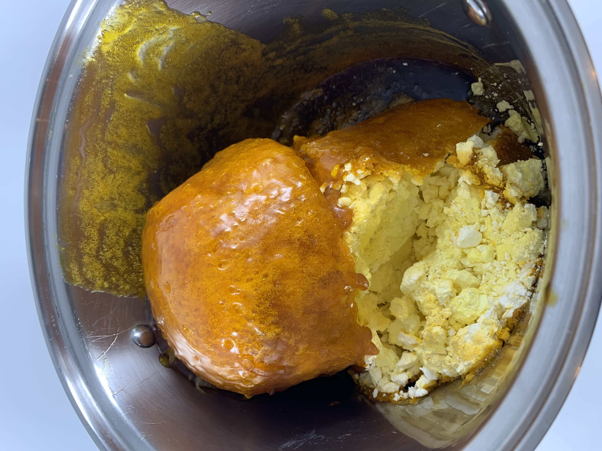
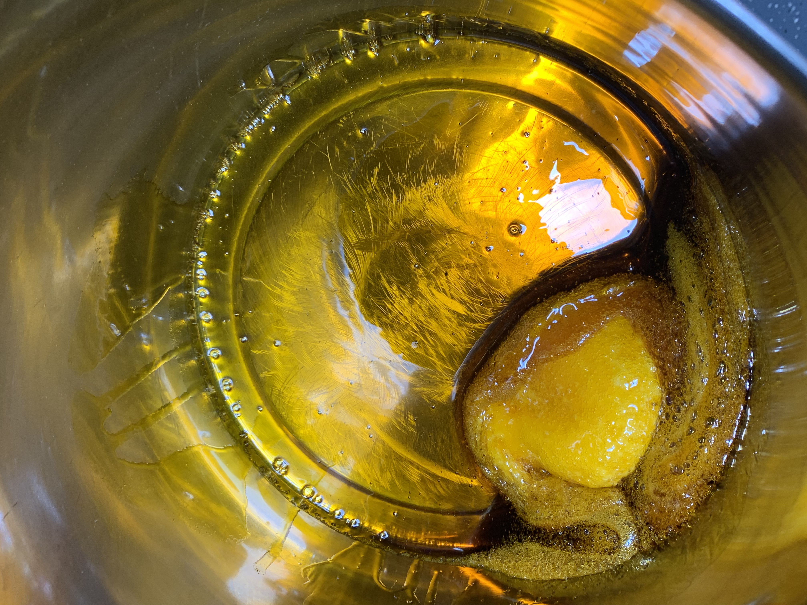

## Close Loop Propane Crude Oil

1.	Extraction from Cannabis sativa hemp Whole Plant that is harvested and immediately Frozen within 48 hours in its freshly harvested state
2.	Fill Frozen hemp in 100-micron Filter Bag with hemp for Extraction
3.	Load Filter bags in Extraction vessels
4.	Fill Vessels with Hydrocarbons 
5.	Saturate vessels for 4 mins
6.	After 4 min soak, Discharge hydrocarbon to collection vessel 
7.	Heat collection vessel with hot water at 120-200 F
8.	When heating collection vessel, Recover hydrocarbon back into tank with vacuum
9.	Depressurize Extraction unit 
10.	Unscrew collection vessel for extracted oil
11.	Extracted oil(s) are purged in vacuum oven at 80-120F for 120 hours at -24 inHg

Optional: Heat Crude oil with Cook Plate @ 100-230 deg. For 1-9 hour for decarboxylation

