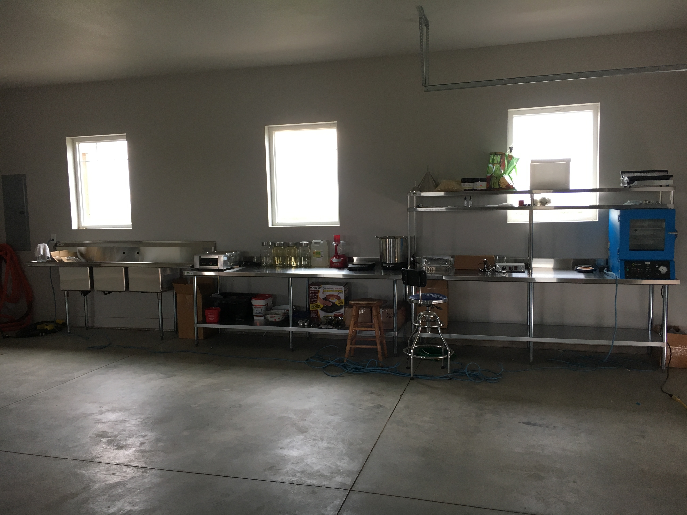
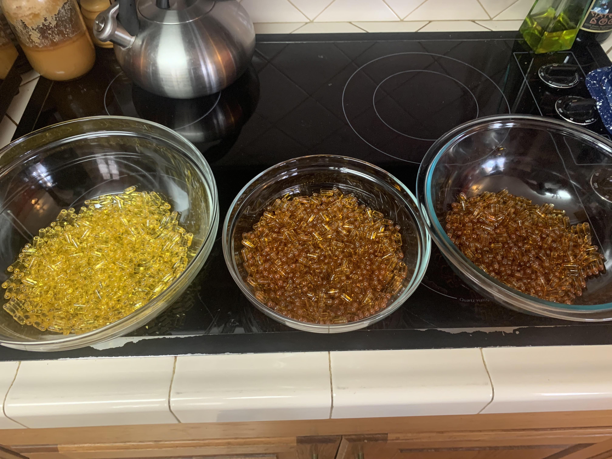
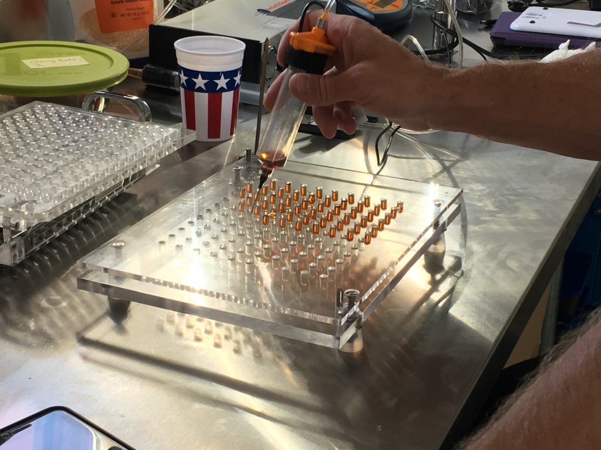
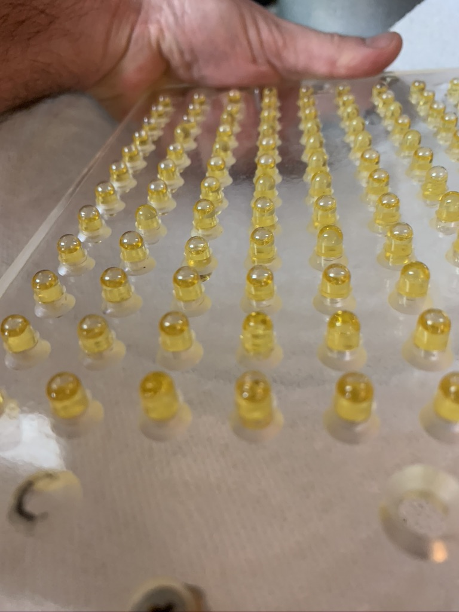
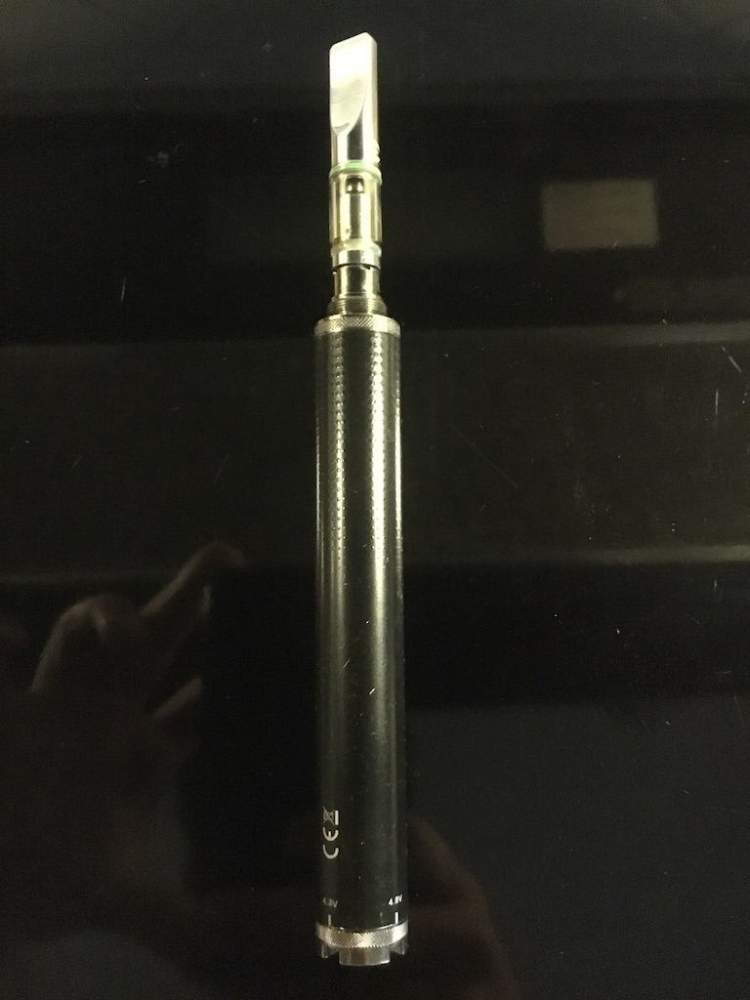

### Biography: The Rise of Western Bakery - Crafting CBD Cannabis Products from the Ground Up

#### Introduction

The journey to creating a cannabis company is one that requires perseverance, creativity, and a deep understanding of both the business landscape and the product being offered. For the founder of **Western Bakery**, a brand that has rapidly become known for its premium CBD cannabis products, this journey started with a single idea: to create a reliable, high-quality CBD product that could be trusted by people looking for natural ways to improve their health and wellness. Combining a passion for cannabis with the skills learned in the kitchen, the founder embarked on an entrepreneurial venture that would not only change their life but also the lives of those who enjoyed their products.

#### Starting from Scratch: The Birth of Western Bakery

Like many entrepreneurs, the creator of Western Bakery was motivated by personal experience. After experiencing the calming and therapeutic effects of CBD, they recognized a gap in the market for cannabis-based products that combined high-quality ingredients with consistency. With the legalization of cannabis gaining momentum across the country, they realized that there was a growing demand for CBD products that were not only effective but also delicious and easy to consume.

The idea behind **Western Bakery** came to life in a humble garage, where the founder transformed the space into a commercial kitchen setup. With no prior experience in manufacturing or running a food production business, they used their skills in cooking and an inherent desire to learn to begin experimenting with different cannabis-infused products. Their initial goal was simple: to create a line of products that was effective, reliable, and infused with top-tier CBD.

#### Mastering the Art of Infusion

Learning how to infuse cannabis into food products took time, patience, and a lot of trial and error. The founder immersed themselves in the science of cannabis infusion, studying techniques for extracting CBD oil and perfecting methods of infusing it into a variety of consumables. The first products that came out of the Western Bakery kitchen were **CBD gummies**, and they quickly became a hit with friends and family who were the first to try them.

From gummies, the product range quickly expanded. The founder learned how to craft **CBD tinctures**, which became popular for their versatility, allowing users to add a few drops to their favorite drinks or take them directly for fast absorption. As demand grew, the founder experimented with **CBD chocolates**, **capsules**, and even **powdered blends** designed for smoothies or baking. Each product was carefully crafted to ensure consistency in dosage, a key factor for customers seeking reliable effects.

One of the biggest challenges was figuring out the precise dosage for each product. Over time, the founder learned how to calibrate recipes so that each serving provided the right amount of CBD, without compromising the taste or experience. Whether it was chocolates that melted perfectly in the mouth, gummies that had just the right balance of sweet and sour, or capsules that provided an easy, discrete way to consume CBD, the founder was dedicated to ensuring every product was crafted with care.

#### From Home Kitchen to Commercial Operations

As Western Bakery's product line expanded and the demand for CBD-infused products grew, the founder realized that the home kitchen was no longer sufficient to meet the growing orders. To scale up production while maintaining the quality they had worked so hard to achieve, the founder transformed the garage into a fully functioning commercial kitchen. This new space allowed them to increase production capacity while adhering to the strict health and safety regulations necessary for food manufacturing.

The setup included professional-grade equipment for mixing, heating, and molding products, ensuring that each batch was consistent in quality. The garage was equipped with an industrial oven for baking, large-scale mixers for combining ingredients, and cooling systems to ensure that products set perfectly before packaging. Despite the professional-grade setup, the founder never lost sight of their original mission: to create a product that was handmade with love and attention to detail.

One of the key decisions in this phase of expansion was investing in high-quality, lab-tested CBD oil, ensuring that each product was not only effective but also safe. The founder knew that the cannabis industry could sometimes be fraught with uncertainty regarding the safety and potency of products, and they were committed to providing transparency. All Western Bakery products were tested for potency and purity, giving customers the confidence that they were consuming a high-quality, consistent product.

#### Building the Brand

As Western Bakery gained traction, the founder realized that building a strong brand identity was crucial for long-term success. They focused on creating a brand that represented more than just the product—it was about a lifestyle. The name “Western Bakery” evoked a sense of tradition, comfort, and quality, while also nodding to the emerging cannabis culture of the West Coast. Their logo, a blend of natural colors and rustic designs, symbolized the balance between nature and craft that defined the brand.

To further strengthen the brand, the founder utilized social media to engage with a growing customer base. Sharing behind-the-scenes looks at the production process, recipes, and customer testimonials helped to create a community around Western Bakery. The founder also worked closely with influencers and health professionals who shared the same passion for natural wellness, helping to spread the word about the brand’s high-quality products.

One of the driving forces behind the success of Western Bakery was the founder's commitment to customer service. They understood that in an industry that was still evolving, providing excellent support was essential. Whether customers had questions about dosage, the effects of CBD, or which product was right for them, the founder made it a point to engage with them personally. This personalized approach helped build trust and loyalty among the growing customer base.

#### Challenges and Growth

Despite the success, the journey was not without its challenges. Navigating the regulatory landscape of the cannabis industry presented obstacles, from obtaining the proper licenses to staying compliant with ever-changing laws. But the founder tackled these challenges head-on, learning the ins and outs of cannabis regulation and working with legal experts to ensure the business operated within the law.

Western Bakery also faced stiff competition from larger, more established cannabis brands. However, the founder's dedication to quality and consistency set the brand apart. They focused on offering a boutique, handcrafted experience that appealed to customers seeking something more personal and special. This attention to detail and the ability to craft unique, high-quality products ensured that Western Bakery had a loyal following.

#### Looking to the Future

As Western Bakery continues to grow, the future is full of possibilities. The founder has plans to expand the product range even further, exploring new avenues for CBD innovation, such as beverages and skincare products. There is also a focus on sustainability, with the company aiming to incorporate more eco-friendly practices in production and packaging.

The journey of Western Bakery, from a home kitchen to a full-fledged commercial operation, is a testament to the founder’s dedication, skill, and passion for the cannabis industry. It shows how far hard work and a commitment to quality can take a person, even when starting from a modest garage kitchen. Western Bakery’s success is not just about crafting great CBD products; it’s about creating a community of customers who trust and appreciate the quality and care that goes into each product.

Today, Western Bakery is not just a company; it's a movement—a brand built on wellness, innovation, and a genuine love for what it creates. The future looks bright for Western Bakery, and the founder's journey is far from over.

