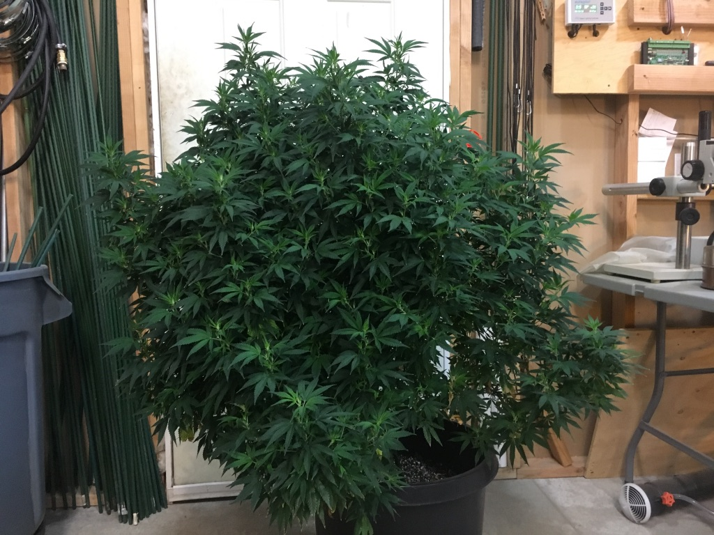
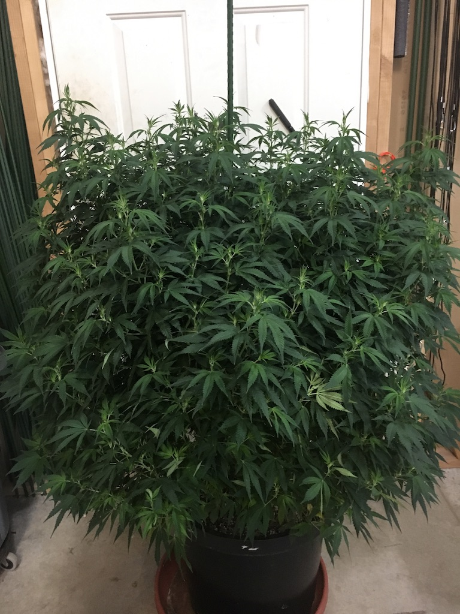

 # Cloning for Propagation
Soak rockwall cirle plugs in 20ml per gallon of water for at least 10 mins. Cut clean 6-10 inch branch in good light. Clean and cut bottom branches and leaves off leaving top few nodes and leaves, put into a cup of water with low water line. Use cutting board to cut a clean 45 degree angle at a node branch spot above water line dry. Immediately dip in clone gel for 15 seconds and plant in cube softly.

Mother Plants

