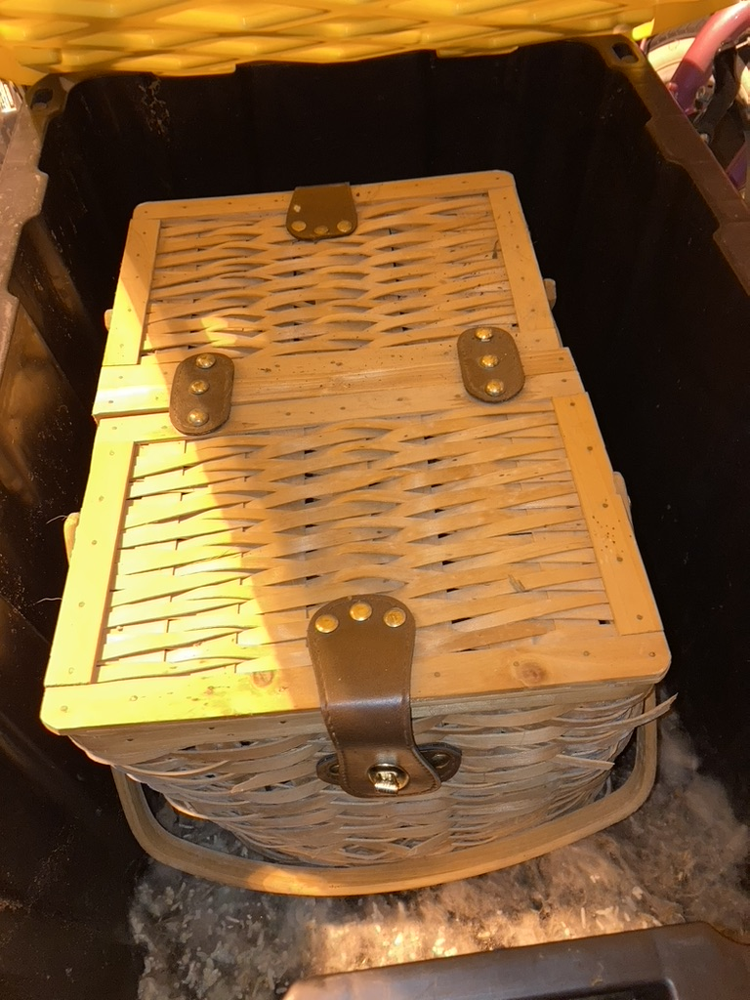
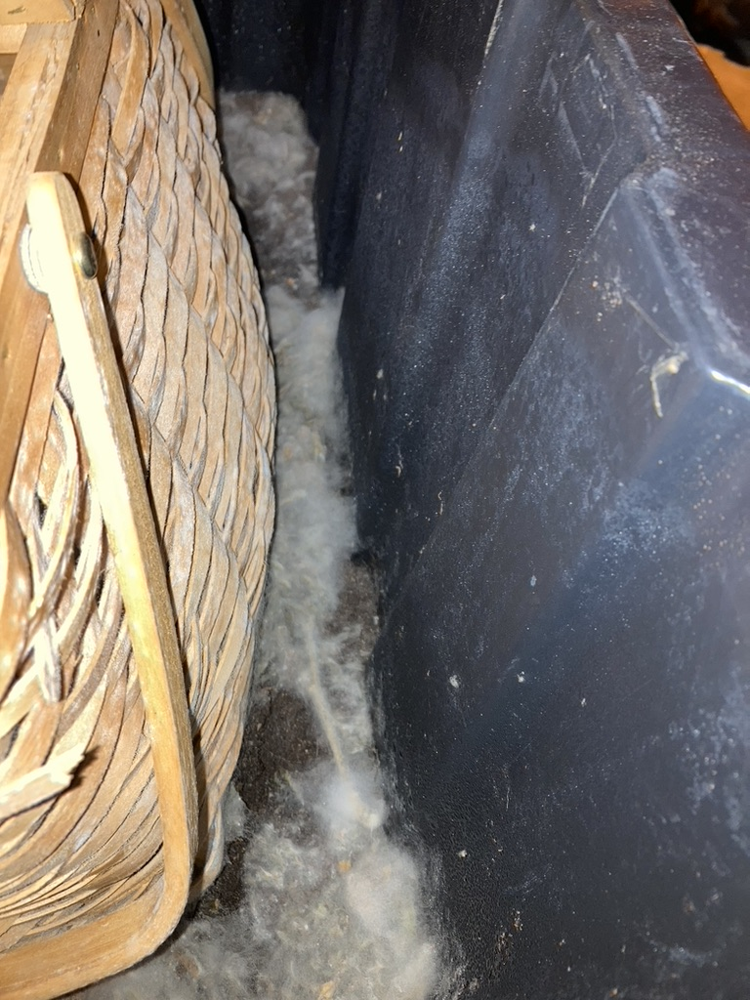
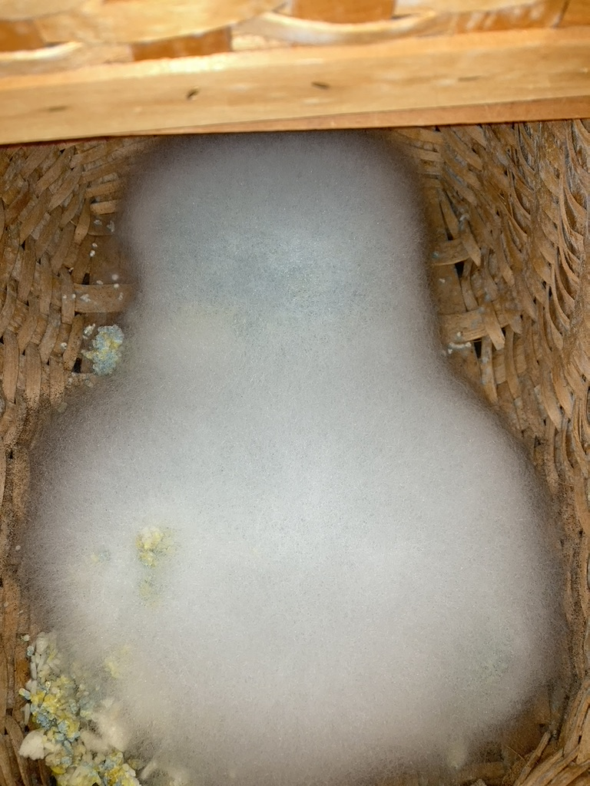
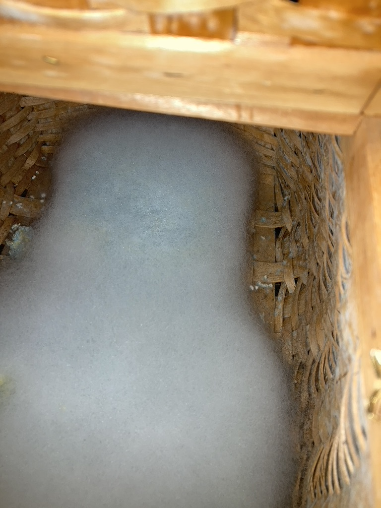
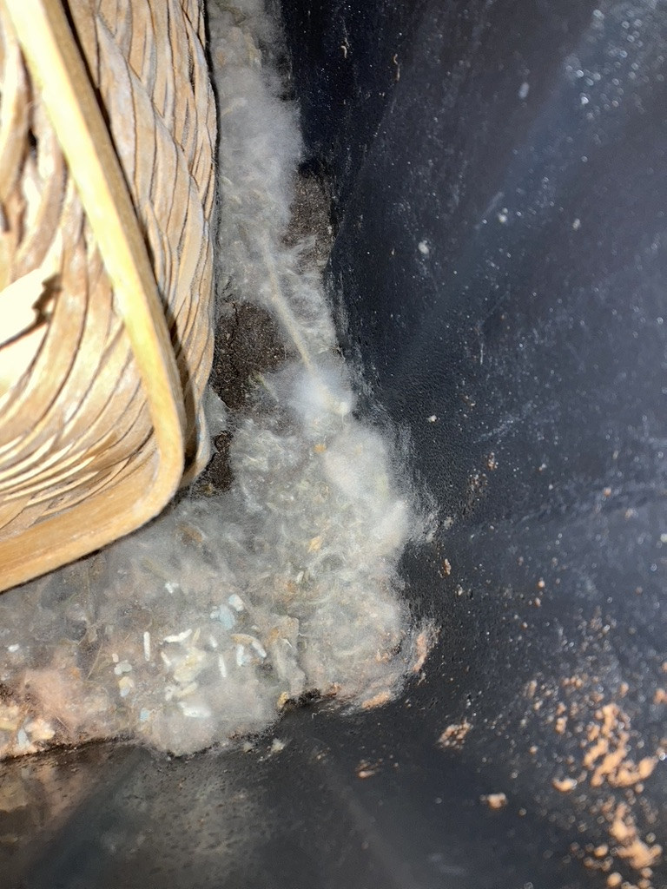
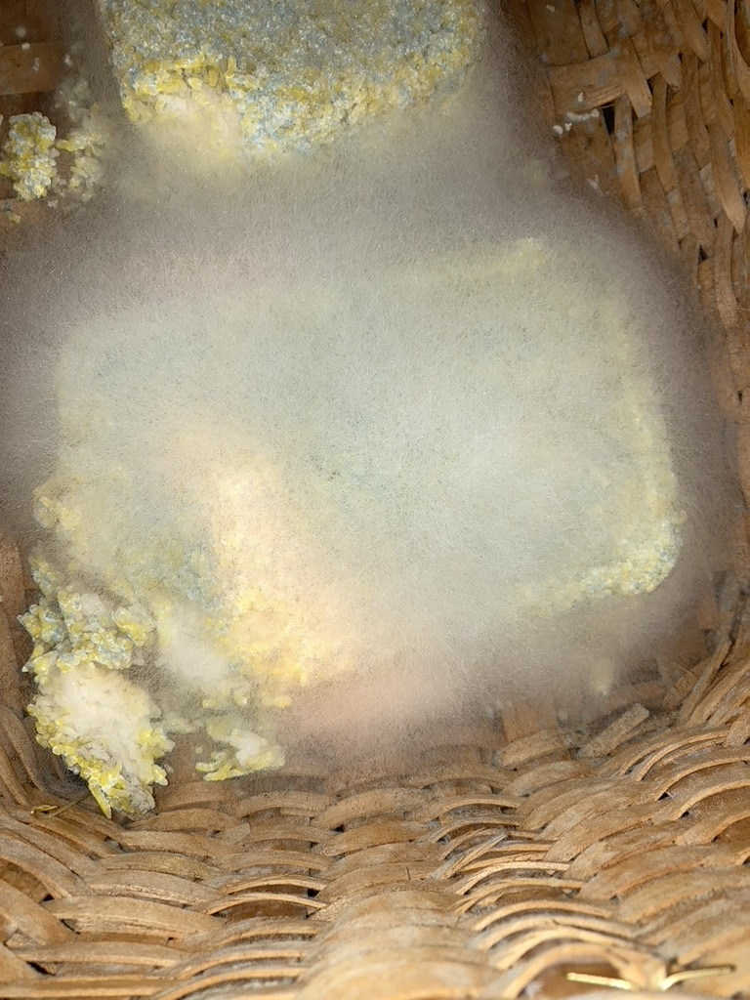
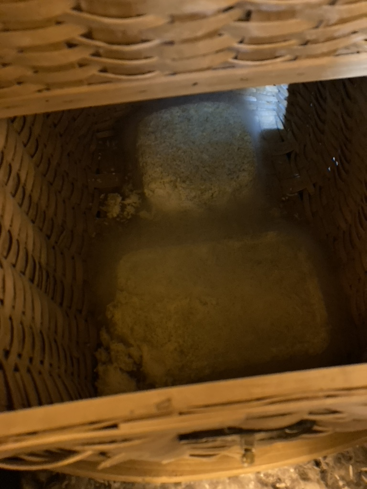
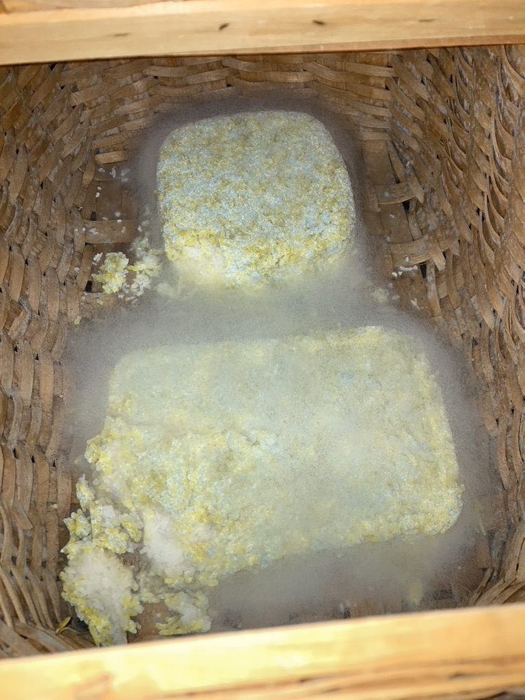

Soak rice with warm water for one hour then drain water and half dry the rice into a cube. Then put in wooden or wicker basket as a cube.

1. Put any compost or indigenous dirt like bison compost on bottom of basket than rice at the top. Place under dry tree for 2-4 weeks or in tote with lid. Depends on temp. 

