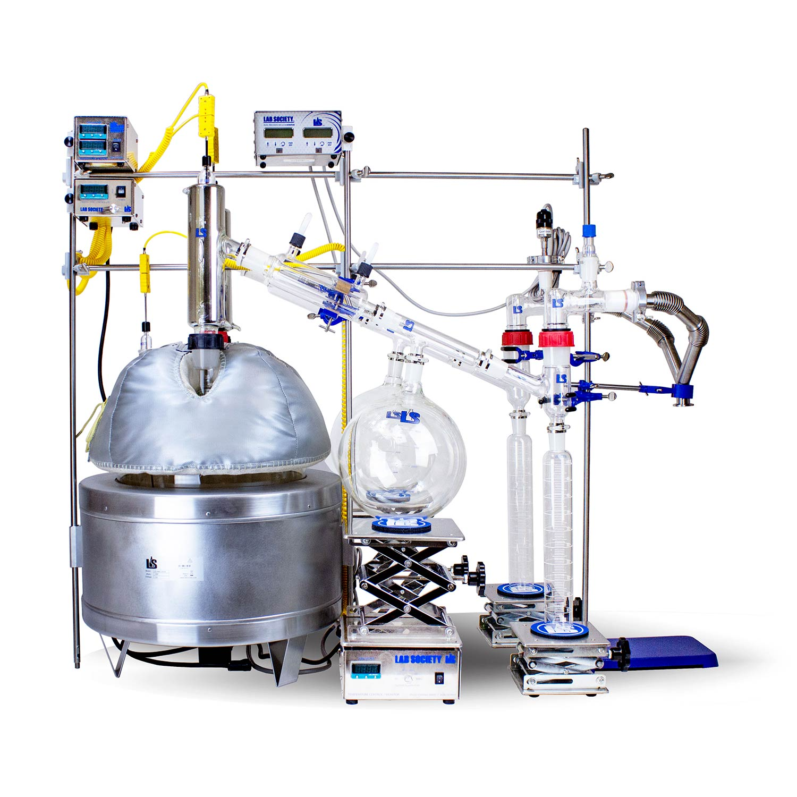

## Distillation With A Short Path

1. Extraction from Cannabis sativa hemp Whole Plant that is harvested and dried
2. Fill dried hemp in 100-micron Filter Bags for Extraction
3. Load filter bags in Extraction vessels
4. Fill Vessels with Hydrocarbons 
5. Saturate vessels for 4 mins
6. After 4 min Saturate, Discharge hydrocarbon into collection vessel 
7. Heat collection vessel with hot water at 120-200 F
8. When heating collection vessel, Recover hydrocarbon back into tank with Vacuum 
9. Depressurize Extraction unit 
10. Unscrew collection vessel for extracted crude oil
11. Heat extracted crude oil with cook plate @ 70-100 deg. for 10-20 mins
12. Add Ethanol to 4/1 ratio in crude oil, put in freezer for 24 hours
13. Winterizing oil in freezer for 24 hours 
14. Put winterize crude oil through 2-micron filter in Buchner funnel with vacuum pump
15. Put winterize crude oil that’s filter into rotary evaporator for ethanol solvent recovery 
16. Ethanol will Start recovering at 68-75 C and the recovery vacuum @ 15 torr
17. Discharge oil out of rotary evaporator 
18. Heat oil on heat plate for decarboxylation @ 99.9 C for 8-9 hours
19. Start Distillation unit heat @75 c
20. Start Chiller cold trap @ -9C
21. Heat crude oil with Heated Stir Plate @ 75 c 
22. Pour Heated Crude oil into Distillation Chamber with Glass funnel 
23. Ramp Slow until 120F
24. Turn on chiller Hot at 75 C
25. Ramp Slow until 220
26. Cool down to 120 before opening
27. Extracted oil(s) are purged in vacuum oven at 80-120F for 50- 120 hours at -24 inHg

