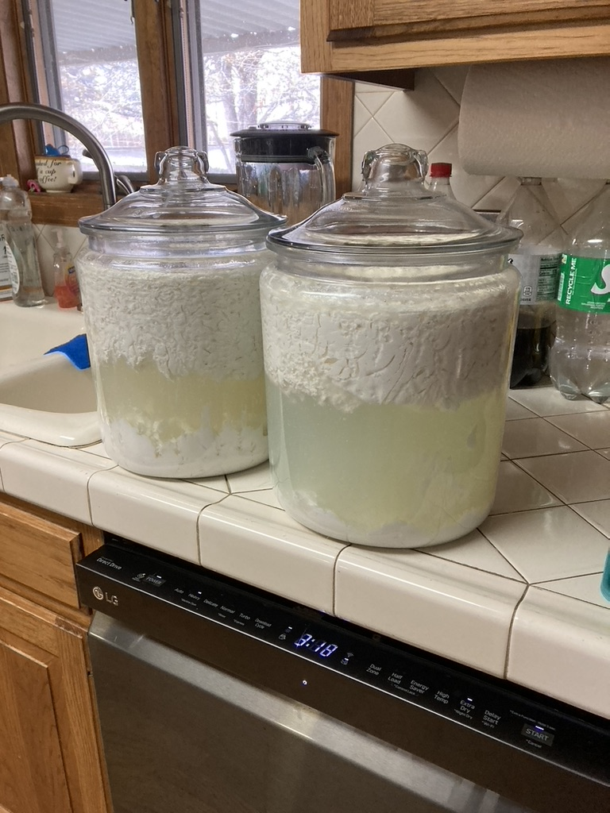

1. Wash 2 cups of rice in warm water but keep drained water for the starch. About 2 cups of drain water needed for 2 gallons.

2. Pour whole organic milk into a jar. 

3. Add rice water into milk.

4. Cover jar with coffee filter. Keep in dark, wiith normal temps. 

5. Ferment milk and rice water until it seperates. Lacto bacteria on bottom and farm house chesse on top. 

