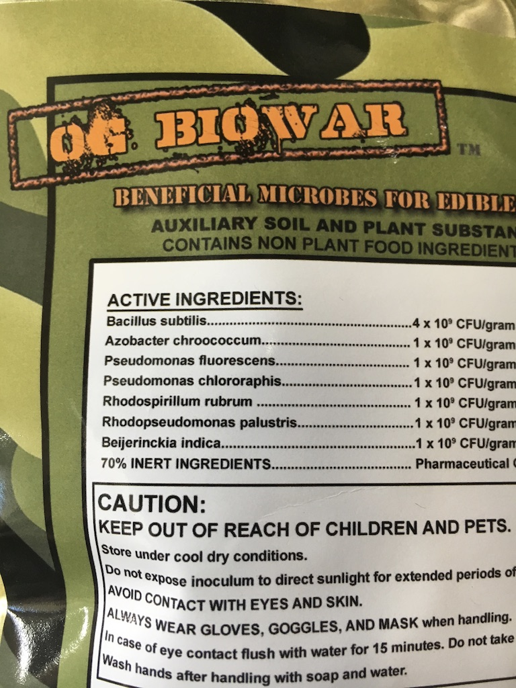
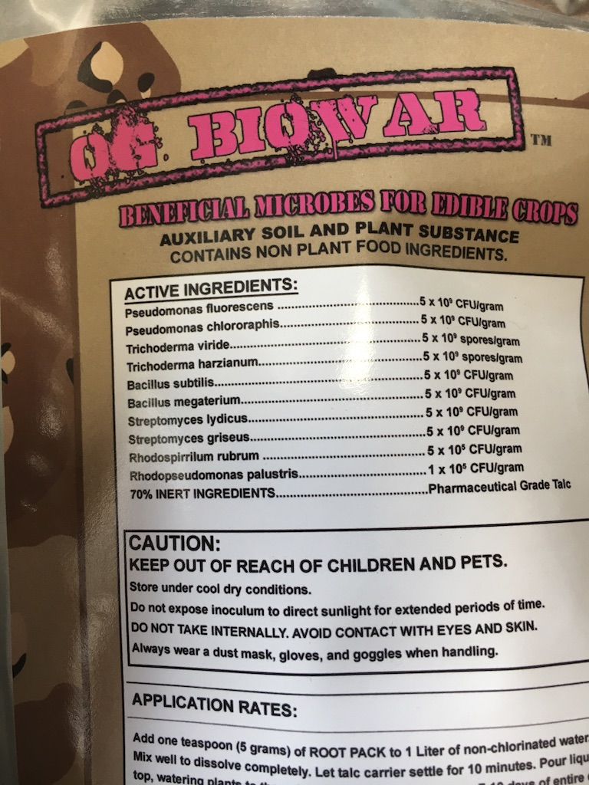
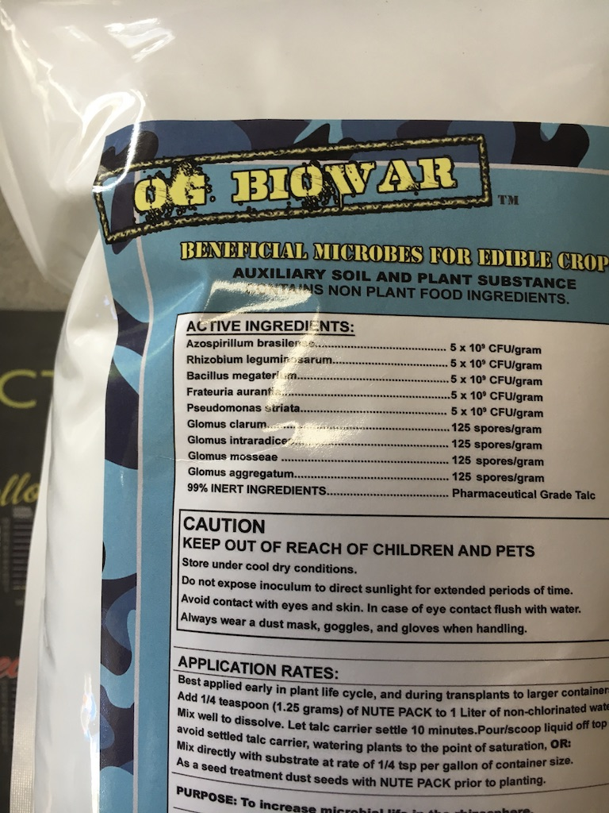
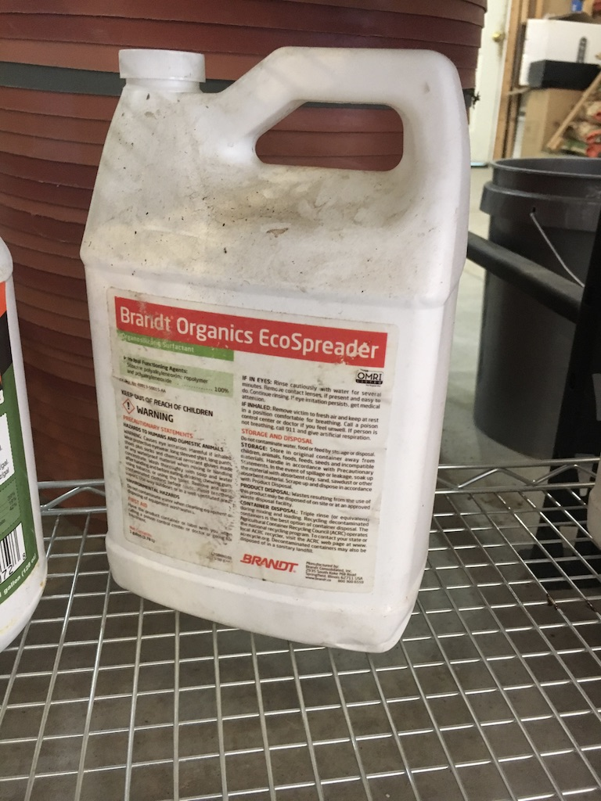
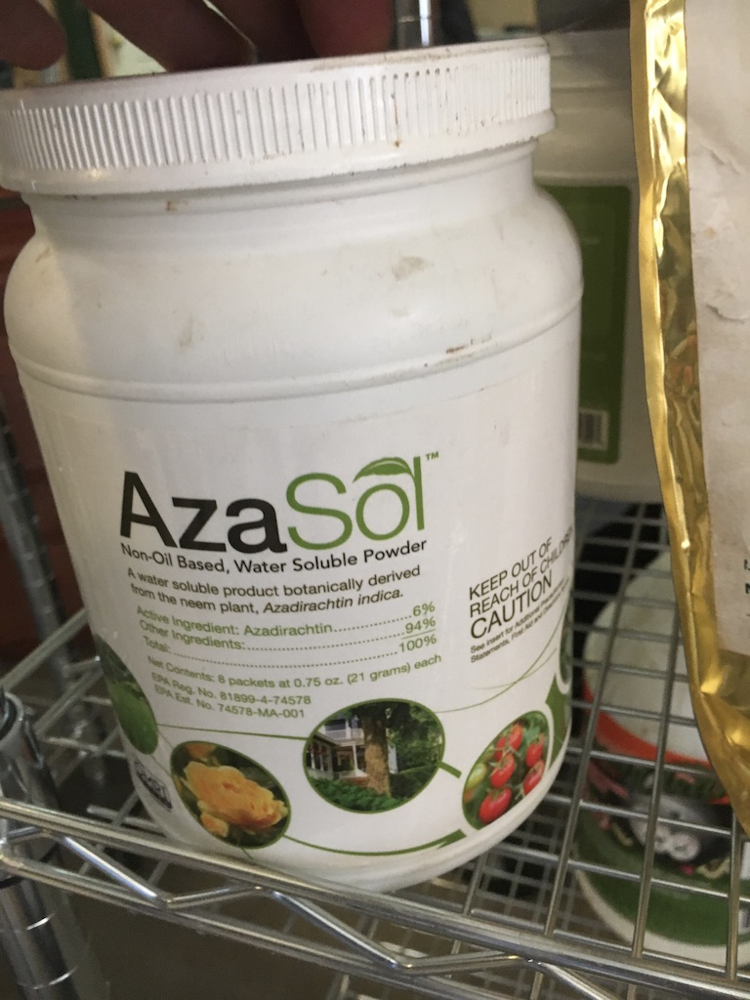

# Organic Fertilizer Recipes

Use trash can or reservor to mix liquid fertilizer with mondia pump. As plants are small feed will be low and gradually increase as growing needs.

## Bio Bizz Fertilizer

### Small to Medium Vegatation Plants - 
After 3-4 weeks of planting clone propogation in soil mix

- Bio Bizz Root - 4 ml/gal
- Bio Bizz Alg-a-mic - 4 ml/gal
- Bio Bizz Fish Mix -  4 ml/gal
- Bio Bizz Grow - 4 ml/gal  https://amzn.to/42wwKYH
- Bio Bizz Bloom - 2 ml/gal
- Bio Bizz Heaven - 2 ml/gal  [Bio Heaven To Buy](https://amzn.to/4gn48o7)
- Epsom Salt - Any Brand - 1/2 gram per gallon
- Calcium - West Coast Horticulture - 4 ml/gal

### Larger Vegatation Plants

- Bio Bizz Root - 6 ml/gal
- Bio Bizz Alg-a-mic - 8 ml/gal
- Bio Bizz Fish Mix -  8 ml/gal
- Bio Bizz Grow - 8 ml/gal
- Bio Bizz Bloom - 6 ml/gal
- Bio Bizz Heaven - 6 ml/gal
- Epsom Salt - Any Brand - 1 gram per gallon
- Calcium - West Coast Horticulture - 6 ml/gal

### Earlier Flowering Plants

- Bio Bizz Alg-a-mic - 12 ml/gal
- Bio Bizz Fish Mix -  10 ml/gal
- Bio Bizz Grow - 10 ml/gal
- Bio Bizz Bloom - 10 ml/gal
- Bio Bizz Heaven - 10 ml/gal
- Epsom Salt - Any Brand - 2 gram per gallon
- Calcium - West Coast Horticulture - 10 ml/gal

### Later Flowering Plants

- Bio Bizz Alg-a-mic - 14 ml/gal
- Bio Bizz Fish Mix -  6 ml/gal
- Bio Bizz Grow - 12 ml/gal
- Bio Bizz Bloom - 14 ml/gal
- Bio Bizz Heaven - 10 ml/gal
- Epsom Salt - Any Brand - 4 gram per gallon
- Calcium - West Coast Horticulture - 10 ml/gal

### Compost Tea 
Brew Compost in filter bag with bubbling water from bottom to top. Add black strap molasses. Brew for 12hrs around 75-80 Degrees, then duluite 50% with water. Feed plants 

- ### 5 gallon brew
 - 3 cups compost in bag
 - 3 tbps black strap molasses
 - Optional to add benefical bacteria or fungi
 - Optional to add bio bizz grow and fish mix

- ### 50 gallon brew
 - 10 cups compost in bag
 - 1 cup black strap molasses
 - Optional to add benefical bacteria or fungi
 - Optional to add bio bizz grow and fish mix

## Best Microbes and Fungi for Cannabis

## Best Spreader or Emulsifer for Sprays

## Best Dry Organic Poison
6% that doesnt burn!

# Watering

# Irrigation Culvert Idea With Overflow

