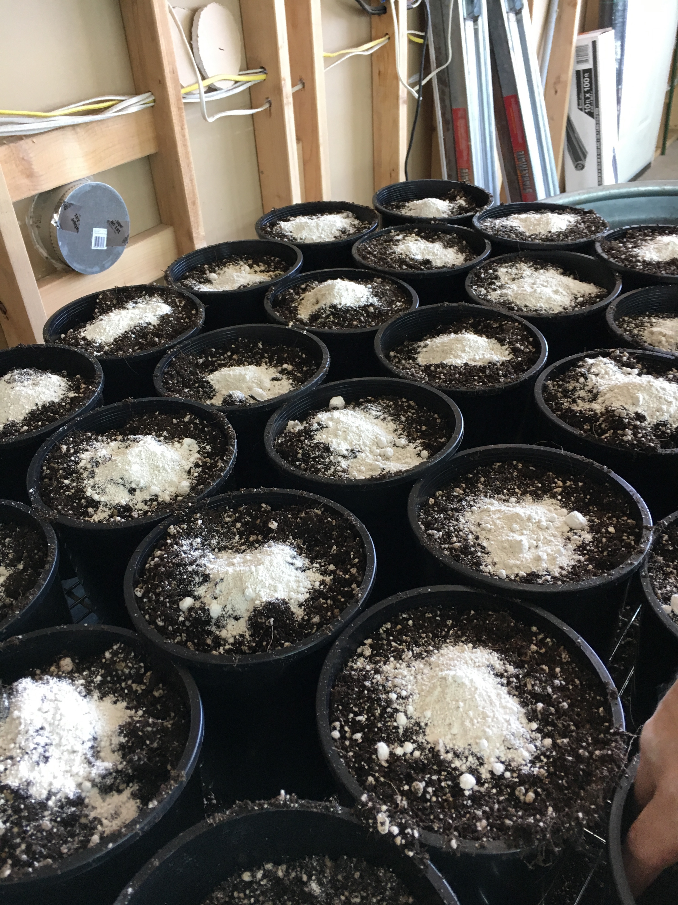
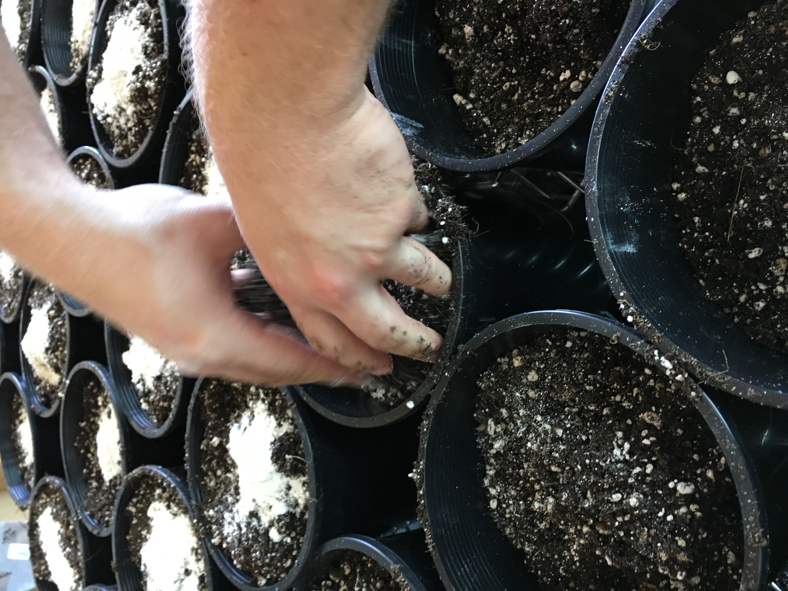
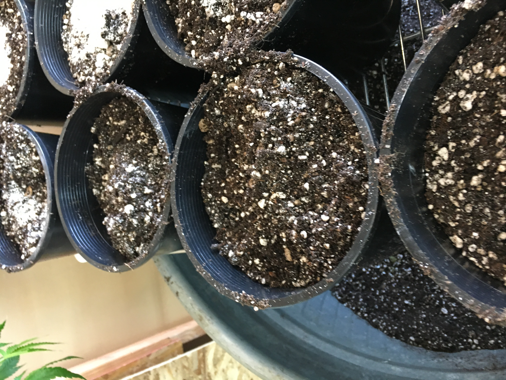

## Clone With Rockwall Cubes
Soak rockwall circle cubes in a CloneEX Clone Solution at 20ml per gallon of water(or one packet). Clone nicer bigger top branches for faster vegatation time but smalls are okay if they are in good light. Cut branch and trim off bottom leaves and branch node sites leaving tops. Take cut branch and place in water cup. Cut a 45 degree cut at or on a bottom branch node site. Immediately dip cutting in CloneEx rooting gel. Soak for 5-30 seconds. Then stick cutting in rockwall gently without squeezing to tight. After all propagations are made gently put on dome lid. Make sure lights are on for 24hrs and at good height depending on how many lights are used. Need lower light or a higher light help. Enviroment needs to be a steady temp a 79-80 Degrees.     
 - ### Supplies
   - Rockwall Circle Plugs
   - CloneEX Solution
   - CloneEx Gel
   - Cutting Board
   - Razor Blades 
   - Cup of Water

Organic options for soil plugs.
- Asobacteria will help organically root as a gel slurry

## Vegetation Proagation Soil Mix
Plants start with a lite mix of Bio Bizz light Mix with super low amounts of Down To Earth "Citus Mix","Cottonseed Meal", Worm Castings, Compost, Bat Guano and some beneifical bacteria and fungi.
 
 -1/2 gallon pots mix = 1/8 cup of Citus Mix, 1/8 wormcastings, 1/8 compost, 1 Tsp of beneifical bacteria and 1 Tsp of beneifical fungi.

 - ### Supplies
 - Bio Bizz Light Mix
 - Down To Earth "Citus Mix"
 - Down To Earth "Cottonseed Meal"
 - Worm Castings - Wiggle Worm or Alaskan Worm
 - Compost - Bison Brew Bag from Grease or Alaskan Humus
 - Bat Guano - Sunleaves makes different types that work from the Madagascan, Indonesian, or Jamaican. 
 - Bacteria - Many good ones... Like OG Bio War root pack or folair pack--or both together. Try to buy separate from fungi.
 - Fungi - Many good ones... Like OG Bio War nute pack. Try to buy separate from bacteria.

## Vegetation & Flowering Soil Mix
Once plants are fully started mix Bio Bizz light Mix with low amounts of Down To Earth "Citus Mix","Cottonseed Meal", Worm Castings, Compost, Sea 90, Bat Guano and some beneifical bacteria and fungi.
 
 - 2 to 3 gallon pots mix = 1/4 cup of Citus Mix, 1/4 wormcastings, 1/4 compost, 1 tsp of Sea 90, 2 Tbsp of beneifical bacteria and 2 Tbsp of beneifical fungi.

- 5 gallon pots mix = Double 2 gallon mix recipe.
- 15 gallon pot mix = 4 x 2 gallon mix recipe.

 - Supplies
 - Bio Bizz Light Mix
 - Down To Earth "Citus Mix"
 - Down To Earth "Cottonseed Meal"
 - Worm Castings - Wiggle Worm or Alaskan Worm
 - Compost - Bison Brew Bag from Grease or Alaskan Humus
 - Sea 90 Mineral Salt
 - Bat Guano - Sunleaves makes different types that work from the Madagascan, Indonesian, or Jamaican. 
 - Bacteria - Many good ones... Like OG Bio War root pack or folair pack--or both together. Try to buy separate from fungi.
 - Fungi - Many good ones... Like OG Bio War nute pack. Try to buy separate from bacteria.
 

